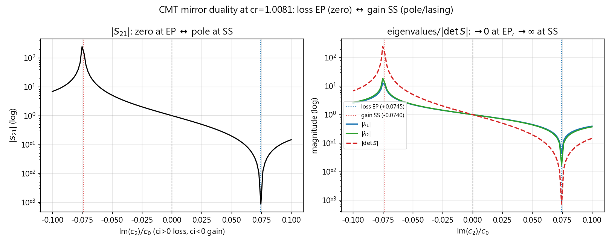

# 增益 EP 与谱奇点理论探索小结

> 用途：沉淀 research 1（gain_ep）到目前为止的**理论探索收获**，供未来复习与查阅。
> 状态：研究笔记（**暂不纳入论文**，待 COMSOL 增益侧验证与后续论证成熟后再定）。
> 最后更新：2026-09-27 ｜ 关联会话：`gain_ep_ss_probe`、`cmt_reflection_s_matrix`

---

## 1. 问题设定

- **Fang 文献**（`group_pubs/fang_ep_metagrating.md`）的反射型声学超表面 EP 位于**损耗**侧：管槽内介质声速 $c_2^i = c_0(c_r + i\,c_i)$，取 $c_i>0$（吸收/损耗），EP 处 $S_{21}\to0$（零点），结构为**完美吸收体（CPA）**。
- **本项目 refs 中的 mph 模型**（`data/research/1_gain_ep/simulation/refs`）使用的是**增益**（$c_i<0$）。
- **核心研究问题**：在声速虚部的**负半平面**（增益侧）是否存在一个与损耗 EP 关于 $c_i=0$ 镜像的 "gain EP"？它到底是什么？**谱奇点（spectral singularity, SS）理论能否描述它**？

### 符号约定（贯穿全文）

- $c_2^i = c_0(c_r + i\,c_i)$，$c_r\approx1.0081$ 为实部比（管槽内声速稍快），$c_i$ 为虚部比。
- **$c_i>0$ = 损耗；$c_i<0$ = 增益**（本项目约定）。
- 复波数 $k_c=\omega/c_{\text{complex}}=k_0/(c_r+i\,c_i)$；管槽模传播因子 $U=e^{2i\beta h}$。
- 工作频率 $f_0=2600\,$Hz（Fang），周期 $d=0.05\,$m，缝宽 $d_0=0.016\,$m，槽深 $h=0.0765\,$m。

---

## 2. 理论工具

### 2.1 CMT 反射型 2×2 S 矩阵

实现见 [`src/pysci/research/gain_ep/theory/cmt_reflection_s_matrix.py`](../../../../src/pysci/research/gain_ep/theory/cmt_reflection_s_matrix.py)
（关键函数：`make_ep_params`、`compute_s_matrix`、`solve_reflection_cmt`；其内部 `main()` 仅扫损耗侧 $c_i\in[0.03,0.16]$）。

- 结构（反射型，S11=S22，互易）：
  $$S=\begin{bmatrix} r_0^L & r_{+1}^R\\ r_{-1}^L & r_0^R\end{bmatrix}=\begin{bmatrix} S_{11} & S_{12}\\ S_{21} & S_{22}\end{bmatrix},\qquad S_{11}=S_{22}.$$
- 本征值：$\lambda_\pm=\dfrac{\operatorname{tr}S\pm\sqrt{(S_{11}-S_{22})^2+4S_{12}S_{21}}}{2}=S_{11}\pm\sqrt{S_{12}S_{21}}$（因 S11=S22）。
- **EP 条件**（Fang）：$S_{21}\to0$ 使 $\lambda_\pm$ 合并、$S$ 亏损为二阶 Jordan 块 $S_{EP}=\begin{bmatrix}E_0&A_0\\0&E_0\end{bmatrix}$；本征矢并线（相位刚性 $r\to0$）；敏感度 $\propto\sqrt{\delta}$。

### 2.2 谱奇点（SS）理论

来源：`data/skills/literature_research/cache/extracted/spectral_singularities/`
（`physics_of_spectral_singularities_2014.md`、`divergent_scattering_spectrum.md`、`ss_pt_symmetry.md`、`ss_applications.md`）。

- SS 条件 $M_{22}(k_*)=0 \Leftrightarrow R,T\to\infty$（$S$ 的**极点**），等价于**零宽度共振**与**激光阈值**：
  $$\mathfrak{g}_{th}=\frac{1}{2L}\ln\!\Big(\frac{1}{|\mathfrak{R}|^2}\Big).$$
- **SS ≠ EP**（无本征函数合并，见 `physics_of_spectral_singularities_2014` 脚注22），但文献称 SS 是"**EP 向连续谱的推广**"（同文 L311）；二者同属非厄密散射奇点家族。
- above-threshold 响应（$I_{ss}\propto(\mathfrak{g}-\mathfrak{g}_{th})$）**必须**引入非线性饱和（`divergent_scattering_spectrum`），线性理论只给阈值。

### 2.3 一个有用的技术发现：β 分支的规范不变性

管槽模色散 $\beta$ 有两个根 $\pm\beta$。源码 `compute_s_matrix` 强制 $\operatorname{Im}\beta\le0$（无源衰减分支，$|U|\le1$）。
数值发现：**$\beta\to-\beta$（即 $U\to1/U$）时，内部模幅 $A\to U\cdot A$ 恰好抵消 $P_3=(1+U)$、$V_3\propto(1-U)$ 的 $1/U$ 缩放（$P_2,P_1$ 仅含 $\alpha$，不变），故反射振幅 $A^-$（即 $S$）逐位不变。**

- 推论 1：$S$ 与极点位置（$\det M=0$）与分支选择**无关**——无源分支对增益侧**同样精确**。
- 推论 2：无源分支 $|U|<1$ 避免增益分支 $|U|>1$ 在 $2\operatorname{Im}\beta\,h\approx452$ 时的 `exp` 溢出 ⇒ 探测增益侧直接用无源分支即可。
- 验证（$c_i=-0.075$）：无源 $\beta[1,0]=-61.98-4.61j$（$|U|=0.835$），增益 $\beta[1,0]=+61.98+4.61j$（$|U|=1.197$），两分支 $S$ 逐位相同。

---

## 3. 核心发现

探测脚本：[`scripts/research/gain_ep/theory/增益半平面谱奇点探测.py`](../../../../scripts/research/gain_ep/theory/增益半平面谱奇点探测.py)（phase0–phase4）。

### 3.1 增益半平面存在谱奇点（S 矩阵极点）

沿 $c_i$ 负向扫描（$c_r=1.0081$）在 $c_i^*\approx-0.074$ 处 $|S_{21}|$ 出现尖锐发散（网格值 $\approx314$；真极点处 $\to\infty$），恰与损耗 EP（$c_i=+0.0745$）关于 $c_i=0$ 镜像。二维 $(c_r,c_i)$ 粗定位（no=6）：极点 $(1.005,-0.070)$，EP $(1.005,+0.070)$。

镜像图：



### 3.2 镜像对偶（仿射图表）

| 量 | LOSS EP ($c_i=+0.0745$) | GAIN SS ($c_i=-0.074$) |
|---|---|---|
| $S_{11}=S_{22}$ | $+0.0142+0.0017j$（小） | $+2.371-3.591j$（大） |
| $S_{21}$ | $+0.00026-0.00038j$，$\|S_{21}\|=4.5\!\times\!10^{-4}$ | $+109.9+294.3j$，$\|S_{21}\|=3.1\!\times\!10^{2}$ |
| $\det S$ | $2.6\!\times\!10^{-4}\to0$ | $3.1\!\times\!10^{2}\to\infty$ |
| 本征值 $\lambda_{1,2}$ | $+0.0356,\;-0.0071$（**合并**，$\|\Delta\lambda\|=4.3\!\times\!10^{-2}$） | $+9.84+12.22j,\;-5.10-19.41j$（**发散+劈裂**，$\|\Delta\lambda\|=3.5\!\times\!10^{1}$） |
| 物理 | 零点 = 完美吸收（CPA） | 极点 = 零宽度共振 = **激射阈值** |

### 3.3 仿射图表下：gain SS 是谱奇点，**不是** EP

在极点处 $\lambda_{1,2}=S_{11}\pm\sqrt{S_{12}S_{21}}$ 中 $\sqrt{S_{12}S_{21}}$ 发散 ⇒ **本征值发散并劈裂**（而非合并），$S$ 趋于秩 1（非亏损 Jordan 块）。故仿射（有限）意义下它是 **SS/极点**，与损耗 EP（零点/本征值合并）不同——对应文献 "SS≠EP 但同族" 与 "SS 是 EP 向连续谱的推广"。

### 3.4 射影图表下：gain SS = **无穷远处的 EP**（对 3.3 的精化）

> 关键洞见（源于一次有益讨论）：3.3 的"非 EP"判断**仅在仿射图表成立**；在射影紧化下，gain SS 确是一个 EP，与损耗 EP **射影同一、仿射对偶**。

**观点一（本征值在 ℂP¹ 合并）**：黎曼球 ℂP¹（一点紧化）上 $+\infty\equiv-\infty$ 为同一点，故反向发散的 $\lambda_\pm$ 在 $\infty$ **合并**。用弦距
$$d(\lambda_1,\lambda_2)=\frac{|\lambda_1-\lambda_2|}{\sqrt{1+|\lambda_1|^2}\sqrt{1+|\lambda_2|^2}}$$
定量化：GAIN SS 处仿射间距达 $35$，但弦距仅 $0.11$（远小于 off 点的 $0.59$）⇒ 在 ℂP¹ 上合并。

**观点二（blow-up 归一化 → 经典 Jordan 块）**：变换 $(S-tI)/\text{dom}$（$t=S_{11}=S_{22}$ 镜面反射幅；$\text{dom}$ = 较大副对角元）是保 EP 结构（保本征矢、亏损性、$\lambda_1=\lambda_2$）的**解奇点/blow-up**：
- 减 $tI$：谱平移，物理上剥离平庸镜面反射，留下反常（模式转换/逆反射）部分；
- 除以 dom：标度归一，物理上**因子掉发散的激射振幅、露出有限的阈值模结构**（即定义阈值处模式轮廓）。

**本征矢并线**（补全 EP 定义的另一半）：GAIN SS 处两右本征矢 $\cos\theta=0.994$（近平行，趋于射线 $(0,1)$），与 LOSS EP 的 $0.999$ 同级。

**phase4 数值对照**（$c_r=1.0081$）：

| 点 | $c_i$ | 仿射 $\|\Delta\lambda\|$ | ℂP¹ 弦距 | 本征矢 $\cos\theta$ | $(S-tI)/\text{dom}$ |
|---|---|---|---|---|---|
| LOSS EP | $+0.0745$ | $4.27\!\times\!10^{-2}$ | $4.26\!\times\!10^{-2}$ | $0.99909$ | $\begin{bmatrix}0&1\\0&0\end{bmatrix}$ |
| GAIN SS | $-0.0740$ | $3.50\!\times\!10^{1}$ | $1.11\!\times\!10^{-1}$ | $0.99382$ | $\begin{bmatrix}0&0\\1&0\end{bmatrix}$ |
| off-EP | $+0.060$ | $6.56\!\times\!10^{-1}$ | $5.92\!\times\!10^{-1}$ | $0.806$ | $\begin{bmatrix}0&1\\0.103&0\end{bmatrix}$ |
| off-SS | $-0.060$ | $6.09\!\times\!10^{0}$ | $5.92\!\times\!10^{-1}$ | $0.806$ | $\begin{bmatrix}0&0.103\\1&0\end{bmatrix}$ |

**读法**：损耗 EP 与增益 SS 经同一归一化后得到**同一个幂零 Jordan 块**（互为转置，经通道交换 $P=\begin{bmatrix}0&1\\1&0\end{bmatrix}$ 相似）；off 点则保留非零副对角元（非 Jordan），且 off-EP/off-SS 互为转置 ⇒ **$c_i\to-c_i$ 镜像 = 通道转置（时间反演）**。

---

## 4. 综合结论

> **gain "EP" 就是谱奇点（SS）——更准确地说，它是一个被推到仿射谱/振幅图表 $\infty$ 处的 EP。**

- **射影结构相同**（EP 本质相通）：同一幂零 Jordan 方向 + 本征矢并线；损耗 EP 在有限点（$\approx0$），增益 SS 在 $\infty$。
- **仿射标度相反**（物理对偶）：零点（$|S|\to0$，完美吸收/CPA）↔ 极点（$|S|\to\infty$，激射阈值/零宽度共振）。
- 二者由 $c_i\to-c_i$（时间反演 / 通道转置）镜像联系，构成"**同一 Jordan 奇点、两侧 CPA↔激射对偶**"的完整图像。
- **边界**：观点二的归一化**非相似变换**，它丢弃了携带物理可观测（零点 vs 极点）的仿射标度；故"射影同一"不等于"物理同一"，两种描述**互补、缺一不可**。above-threshold 行为需非线性饱和，线性 CMT 只到阈值/极点。

---

## 5. 对仿真的指导意义

- refs 中 mph 模型用增益（$c_i<0$）是**对的**：增益侧 $c_i^*\approx-0.074$ 处 CMT 预言 $|S_{21}|\to\infty$，对应 COMSOL 中**场发散 / 解不收敛 / 反射振幅急升**——即预期的**激射阈值**信号，而非数值失败。
- 单点散点验证应取**离极点稍远**处（如 $c_i=-0.05,-0.06,-0.07$）：CMT 预测 $|S_{21}|$ 随 $c_i\to c_i^*$ 单调上升（约 $12\to41\to314$），COMSOL 反射振幅应呈相同发散趋势，且无需真正求解奇异的阈值点。

---

## 6. 可复现性

| 项目 | 路径 |
|---|---|
| CMT 反射 S 矩阵模块 | `src/pysci/research/gain_ep/theory/cmt_reflection_s_matrix.py` |
| 增益半平面谱奇点探测脚本（phase0–4） | `scripts/research/gain_ep/theory/增益半平面谱奇点探测.py` |
| 探测会话（图/日志） | `data/research/1_gain_ep/theory/gain_ep_ss_probe/` |
| 阶段一 CMT 会话（参数空间/黎曼面图） | `data/research/1_gain_ep/theory/cmt_reflection_s_matrix/` |
| MATLAB 参考实现 | `data/research/1_gain_ep/theory/参考-透反射管槽结构的S矩阵理论计算/` |

运行：

```powershell
$env:PYTHONUTF8='1'; $env:PYTHONIOENCODING='utf-8'
uv run python scripts/research/gain_ep/theory/增益半平面谱奇点探测.py
```

> 说明：CMT 数值收敛参数 `n_orders=10, k_modes=31`（精算）/ `6, 21`（粗扫）。极点位置随网格略动（$c_i^*\approx-0.074$ 为网格值，真极点处 $|S_{21}|\to\infty$）。

---

## 7. 未来方向

1. **COMSOL 增益侧离极点散点验证**（$c_i=-0.05/-0.06/-0.07$）：确认场发散趋势与 CMT 一致。
2. **非线性饱和 SS 模型**：探索 above-threshold（$I\propto g-g_{th}$）与 CPA–激光对偶的完整闭环。
3. **论文小节（待成熟）**："EP↔SS 射影统一"——弦距 + blow-up 归一化 + 本征矢并线三判据，及 CPA↔激射对偶表。

---

## 参考数据来源（本地）

- `data/skills/literature_research/cache/extracted/spectral_singularities/`：`physics_of_spectral_singularities_2014.md`、`divergent_scattering_spectrum.md`、`ss_pt_symmetry.md`、`ss_applications.md`
- `data/skills/literature_research/cache/extracted/group_pubs/fang_ep_metagrating.md`
- `data/skills/literature_research/cache/extracted/pt_review_gong_2018.md`（§9 含声学 EP/CPA 实验）
